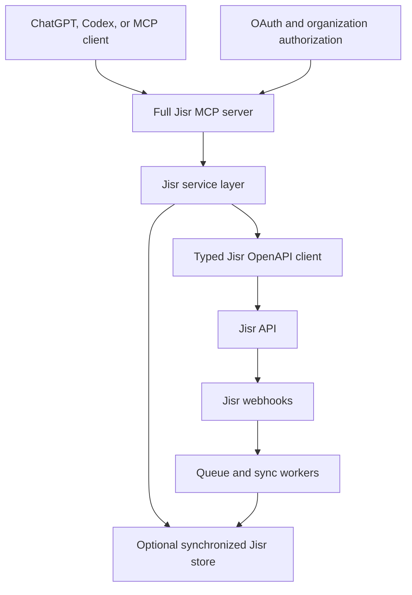

# Full Jisr MCP Server — Implementation Plan

> Implementation-ready specification for building a secure, multi-tenant Model Context Protocol server that exposes the complete publicly documented Jisr Open API surface to authorized AI clients.

**Document status:** Ready for implementation  
**Version:** 2.0  
**Prepared:** 2026-08-29  
**Primary language:** TypeScript  
**MCP transport:** Remote Streamable HTTP  
**Upstream system:** Jisr HR  
**Primary objective:** Retrieve and manage all Jisr information made available through the organization's authorized Open API permissions  
**Secondary objective:** Provide optional derived KPI and analytics tools above the full Jisr data layer

---

## 1. Instructions for the CLI Agent

You are implementing this system, not only reviewing the plan.

Before changing an existing repository:

1. Read all repository instructions, including `AGENTS.md`, `CLAUDE.md`, `README.md`, architecture documents, package scripts, CI workflows, migrations, and deployment configuration.
2. Inspect the complete codebase before proposing structural changes.
3. Identify what already exists and reuse it when technically sound.
4. Preserve unrelated user changes.
5. Verify the installed MCP SDK and use its current official server and transport APIs. Do not rely on old MCP examples without verification.
6. Verify the live Jisr OpenAPI specification before implementing endpoint schemas. Public documentation can evolve.
7. Implement in phases and verify each phase before continuing.
8. Maintain this document during implementation:
   - Mark completed checklist items.
   - Add material decisions to the Decision Log.
   - Record undocumented Jisr behavior under Open Questions.
9. Never invent an undocumented Jisr endpoint, payload, webhook guarantee, permission, or rate limit.
10. Never declare completion while required tests, authorization checks, or MCP Inspector validation remain incomplete.

If no repository exists, scaffold a production-oriented TypeScript repository using the structure in this document.

---

## 2. Corrected Product Scope

This project is a **full Jisr MCP**, not only an Employee KPI MCP.

The MCP must expose every operation that is publicly documented in the Jisr OpenAPI specification and permitted by the connected organization's Jisr API key.

The current documented Jisr API domains are:

```text
Authentication
Accruals
Attendance
Attendance Logs
Employees
Employee Financial Information
Employee Leave
Finance
Payroll Transactions
Accounting Journals
Lookups
Webhooks
Audit Events
```

KPI calculation is an optional higher-level module. It must not determine the server's data model, tool structure, or authorization model.

### Meaning of “all Jisr information”

For this plan, “all information” means:

- All records and fields Jisr exposes through its documented Open API.
- All records allowed by the organization's configured API-key permissions.
- All records allowed by the authenticated MCP user's organization role and scopes.
- Complete pagination through Jisr collections within bounded server limits.
- Full-fidelity internal mapping of documented Jisr response fields.
- Optional source-shaped results for highly privileged users when policy allows them.

It does not mean:

- Scraping the Jisr web application.
- Accessing undocumented internal APIs.
- Circumventing the organization's Jisr permissions.
- Returning API keys, secrets, access tokens, or inaccessible modules.
- Assuming that every feature visible in the Jisr UI has an Open API endpoint.

---

## 3. Release Strategy

### Release 1 — Complete Read-Only Jisr MCP

Implement every publicly documented GET operation:

- Employees and individual employee information.
- Employee financial information under a dedicated sensitive scope.
- Attendance summaries.
- Attendance logs.
- Annual leave summaries.
- Accrual transactions.
- Employee monthly payables.
- Payroll transactions.
- GL transaction types.
- Paygroups.
- Accounting journal retrieval.
- All documented lookups.
- Webhook subscription retrieval.
- Audit events.
- Connection, capability, permission, and synchronization status.

Release 1 is the mandatory first production release.

### Release 2 — Controlled Jisr Write and Administration Tools

Add separately reviewed, permissioned operations:

- Create employee.
- Create attendance logs or punches.
- Create accounting journals.
- Create, update, delete, and test webhooks.
- Delete payroll transactions if the organization's workflow explicitly requires it.

Every write tool must have explicit OAuth scopes, server-side authorization, accurate MCP safety annotations, audit logging, idempotency where possible, and user confirmation behavior appropriate to its consequences.

### Release 3 — Optional Derived Analytics and KPI Module

Add domain-specific tools above synchronized Jisr data:

- Attendance KPI.
- Leave analytics.
- Headcount analytics.
- Payroll summaries.
- Organization insights.
- Data-quality insights.
- Optional external performance sources such as Jira, Notion, GitHub, CRM, or learning systems.

Release 3 must remain modular. The full Jisr MCP must operate without it.

---

## 4. High-Level Architecture

Use a hybrid architecture: live Jisr requests for freshness and complete authorized retrieval, plus synchronized storage for history, fast search, cross-period analysis, and resilience.



### 4.1 Live Mode

Use live Jisr requests when:

- The user explicitly requests the latest source state.
- The requested domain is not synchronized locally.
- Sensitive finance data should not be retained locally.
- An administrative action requires current state.
- A record is being verified before a write.

### 4.2 Indexed Mode

Use synchronized data when:

- Searching employees efficiently.
- Resolving names to stable employee IDs.
- Producing historical comparisons.
- Answering during temporary Jisr outages.
- Calculating analytics or KPIs.
- Enforcing reporting hierarchies.
- Returning large collection summaries without repeatedly scanning Jisr.

### 4.3 Hybrid Result Rules

Every read result must indicate:

```text
source: live_jisr | synchronized_jisr
dataAsOf
isStale
isPartial
nextCursor or pagination metadata when applicable
```

The client must never be misled into believing synchronized data is live.

---

## 5. Official Jisr API Hosts and Authentication

### 5.1 Base URLs

Jisr documents two hosting patterns:

```text
AWS-hosted organization:
https://apis.jisr.net/api

Locally hosted organization:
https://api.jisr.net.sa/api/
```

Store the base URL per connection. Do not infer it from untrusted user input at tool-call time. Validate it against an approved host allowlist during connection setup.

### 5.2 API-Key Provisioning

A Jisr administrator creates API credentials through:

```text
Settings → Webhook & API Keys → API Keys → Add New API Key
```

The admin chooses the APIs and lookups available to the key. The API secret is documented as copyable only once.

Use separate Jisr API keys for materially different permission sets when feasible, for example:

```text
Core HR read key
Finance read key
Integration administration key
Write operations key
```

Do not grant finance or write permissions to a key used only for ordinary employee lookup.

### 5.3 Authentication Endpoint

```http
POST /openapi/v1/auth
```

Standard headers:

```http
slug: organization-slug
api-key: generated-api-key
secret: generated-api-secret
api-version: 1
source: open_api
```

The documented success response returns the access token in `data`.

Subsequent requests use:

```http
Slug: organization-slug
Access-Token: generated-access-token
api-version: 1
```

Requirements:

- Encrypt API key and secret at rest.
- Never return them through MCP.
- Never log them.
- Cache access tokens securely.
- Do not assume a fixed token lifetime.
- On an eligible authentication failure, invalidate the token and perform at most one controlled re-authentication attempt.
- Prevent refresh loops.
- Isolate token caches by organization, connection, key identity, and permission set.

### 5.4 External Aggregator Route

Jisr's public documentation references:

```text
source: external_aggregator
username: external-service-name
```

Do not guess the onboarding or credential contract. Keep the authentication strategy extensible and confirm the official aggregator process with Jisr before implementation.

---

## 6. Complete Documented Endpoint Inventory

The CLI agent must compare this inventory with the current live Jisr OpenAPI specification before coding.

### 6.1 Authentication

| Method | Endpoint | Purpose |
|---|---|---|
| POST | `/openapi/v1/auth` | Generate Jisr access token |

### 6.2 Accruals

| Method | Endpoint | Purpose |
|---|---|---|
| GET | `/openapi/v1/accrual_transactions` | List accrual transactions |

### 6.3 Attendance

| Method | Endpoint | Purpose |
|---|---|---|
| GET | `/openapi/v1/attendance/summary` | Retrieve employee attendance summaries |

### 6.4 Attendance Logs

| Method | Endpoint | Purpose |
|---|---|---|
| GET | `/openapi/v1/attendance_logs` | List successful or failed attendance punches |
| POST | `/openapi/v1/attendance_logs` | Create a group of attendance punches |

### 6.5 Employees

| Method | Endpoint | Purpose |
|---|---|---|
| GET | `/openapi/v1/employees` | List employees |
| POST | `/openapi/v1/employees` | Create an employee |
| GET | `/openapi/v1/employees/basic_info` | Retrieve individual employee basic information |
| GET | `/openapi/v1/employees/financial_info` | Retrieve individual employee financial information |

### 6.6 Employee Leave

| Method | Endpoint | Purpose |
|---|---|---|
| GET | `/openapi/v1/employee_leaves/summary` | Retrieve annual leave summary |

### 6.7 Finance and Payroll

| Method | Endpoint | Purpose |
|---|---|---|
| GET | `/openapi/v1/employee_monthly_payables` | List employee monthly payables |
| GET | `/openapi/v1/payroll_transactions` | List payroll transactions |
| DELETE | `/openapi/v1/payroll_transactions/{id}` | Delete a payroll transaction |
| GET | `/openapi/v1/gl_transaction_types` | List GL transaction types |
| GET | `/openapi/v1/paygroups` | List organization paygroups |

### 6.8 Accounting Journals

| Method | Endpoint | Purpose |
|---|---|---|
| POST | `/openapi/v1/accounting/journals` | Create accounting journals |
| GET | `/openapi/v1/accounting/journals/{id}` | Retrieve an accounting journal |

### 6.9 Lookups

| Method | Endpoint | Purpose |
|---|---|---|
| GET | `/openapi/v1/lookups/departments` | List departments |
| GET | `/openapi/v1/lookups/employment_types` | List employment types |
| GET | `/openapi/v1/lookups/business_units` | List business units |
| GET | `/openapi/v1/lookups/locations` | List locations |
| GET | `/openapi/v1/lookups/nationalities` | List nationalities |
| GET | `/openapi/v1/lookups/outsourcing_companies` | List outsourcing companies |

### 6.10 Webhooks

| Method | Endpoint | Purpose |
|---|---|---|
| GET | `/openapi/v1/webhooks` | List webhook subscriptions |
| POST | `/openapi/v1/webhooks` | Create webhook subscription |
| PUT | `/openapi/v1/webhooks/{id}` | Update webhook subscription |
| DELETE | `/openapi/v1/webhooks/{id}` | Delete webhook subscription |
| POST | `/openapi/v1/webhooks/{id}/test` | Test webhook subscription |

### 6.11 Audit Events

| Method | Endpoint | Purpose |
|---|---|---|
| GET | `/openapi/v1/audit_events` | List filtered audit events |

### 6.12 API Coverage Gate

Create a machine-readable endpoint manifest in the repository. Tests must fail when the implemented manifest and the approved specification snapshot diverge unexpectedly.

Suggested file:

```text
src/integrations/jisr/endpoint-manifest.ts
```

Each manifest entry should contain:

```text
domain
operationId
method
path
readOrWrite
sensitivity
requiredJisrPermission
requiredMcpScope
implementedTool
release
```

---

## 7. MCP Tool Organization

The full endpoint surface is larger than a small MCP. Organize tools by domain and expose only tools permitted by the authenticated user's token and organization policy.

Recommended tool-name convention:

```text
jisr_<domain>_<action>
```

Do not expose a generic `jisr_api_request`, arbitrary path, arbitrary URL, or arbitrary HTTP tool.

### 7.1 Discovery and Connection Tools

```text
jisr_connection_status_get
jisr_capabilities_get
jisr_data_catalog_get
jisr_sync_status_get
```

### 7.2 Core HR Tools

```text
jisr_employees_list
jisr_employee_basic_info_get
jisr_employee_financial_info_get
jisr_employee_create
```

### 7.3 Time, Attendance, Leave, and Accrual Tools

```text
jisr_attendance_summary_get
jisr_attendance_logs_list
jisr_attendance_logs_create
jisr_employee_leave_summary_get
jisr_accrual_transactions_list
```

### 7.4 Finance and Accounting Tools

```text
jisr_employee_monthly_payables_list
jisr_payroll_transactions_list
jisr_payroll_transaction_delete
jisr_gl_transaction_types_list
jisr_paygroups_list
jisr_accounting_journal_get
jisr_accounting_journal_create
```

### 7.5 Lookup Tools

```text
jisr_departments_list
jisr_employment_types_list
jisr_business_units_list
jisr_locations_list
jisr_nationalities_list
jisr_outsourcing_companies_list
```

### 7.6 Integration Administration Tools

```text
jisr_webhooks_list
jisr_webhook_create
jisr_webhook_update
jisr_webhook_delete
jisr_webhook_test
```

### 7.7 Audit Tools

```text
jisr_audit_events_list
```

### 7.8 Optional Analytics Tools

```text
jisr_analytics_headcount_get
jisr_analytics_attendance_get
jisr_analytics_leave_get
jisr_analytics_payroll_get
jisr_kpi_score_get
jisr_kpi_score_explain
```

Analytics tools are not substitutes for source-data tools.

### 7.9 Dynamic Tool Exposure

Filter `tools/list` based on:

- Organization connection capabilities.
- Jisr key permissions.
- OAuth scopes.
- User organization role.
- Feature flags.
- Release status.

A normal employee should not even discover payroll, financial-info, webhook-admin, or destructive tools.

If the target MCP client supports deferred tool loading or tool search, organize domains so they can be loaded only when needed.

---

## 8. Tool Safety Classification

### 8.1 Read-Only Tools

All GET-backed tools:

```text
readOnlyHint: true
destructiveHint: false
openWorldHint: false
```

The annotations must match actual behavior. A tool marked read-only must not trigger upstream writes, webhook creation, sync configuration changes, or other mutations.

### 8.2 Non-Destructive Write Tools

Examples:

```text
jisr_employee_create
jisr_attendance_logs_create
jisr_accounting_journal_create
jisr_webhook_create
jisr_webhook_update
jisr_webhook_test
```

Typical annotations:

```text
readOnlyHint: false
destructiveHint: false
openWorldHint: false
```

They still require confirmation and strict authorization because they change Jisr.

### 8.3 Destructive Tools

Examples:

```text
jisr_payroll_transaction_delete
jisr_webhook_delete
```

Annotations:

```text
readOnlyHint: false
destructiveHint: true
openWorldHint: false
```

Release destructive tools only after separate workflow approval and test coverage.

### 8.4 Two-Step High-Risk Writes

For high-impact writes, prefer prepare/commit patterns even when the underlying API has one endpoint.

Example:

```text
jisr_payroll_transaction_delete_prepare
jisr_payroll_transaction_delete_commit
```

The prepare tool must retrieve and summarize the current target, verify authorization, and issue a short-lived server-bound confirmation reference. The commit tool must re-validate the target and authorization before deletion.

Never accept an arbitrary confirmation string generated by the model.

---

## 9. Roles and Permission Model

### 9.1 Employee Self-Service Reader

Possible access:

- Own basic employee information.
- Own attendance summary.
- Own attendance logs if policy permits.
- Own leave summary.

No organization enumeration or finance access.

### 9.2 Manager Reader

Possible access:

- Authorized direct reports.
- Optional indirect reports under explicit policy.
- Team attendance and leave information.

No financial information unless a separate finance role is assigned.

### 9.3 HR Operations

Possible access:

- Organization employees.
- Employee basic information.
- Organization lookups.
- Attendance, leave, and accruals.
- Employee creation if separately authorized.

### 9.4 Payroll and Finance

Possible access:

- Employee financial information.
- Monthly payables.
- Payroll transactions.
- GL transaction types.
- Paygroups.
- Accounting journals.

Finance access must be separate from general HR access.

### 9.5 Integration Administrator

Possible access:

- Connection status and capabilities.
- Webhook subscriptions.
- Webhook create, update, delete, and test.
- Synchronization status.

Integration administration does not automatically grant employee financial-data access.

### 9.6 Auditor

Possible access:

- Audit events.
- Read-only connection and sync status.
- Selected source records required for an authorized investigation.

### 9.7 Platform Operator

Platform infrastructure access must not automatically imply organization HR or finance-data access.

---

## 10. Recommended OAuth Scopes

Use granular scopes. Suggested initial scope inventory:

```text
jisr:connection:read
jisr:catalog:read
jisr:sync:read

jisr:employees:self:read
jisr:employees:team:read
jisr:employees:organization:read
jisr:employees:financial:read
jisr:employees:create

jisr:attendance:self:read
jisr:attendance:team:read
jisr:attendance:organization:read
jisr:attendance:create

jisr:leave:self:read
jisr:leave:team:read
jisr:leave:organization:read
jisr:accruals:read

jisr:finance:monthly_payables:read
jisr:finance:payroll_transactions:read
jisr:finance:payroll_transactions:delete
jisr:finance:gl:read
jisr:finance:paygroups:read
jisr:finance:journals:read
jisr:finance:journals:create

jisr:lookups:read

jisr:webhooks:read
jisr:webhooks:create
jisr:webhooks:update
jisr:webhooks:delete
jisr:webhooks:test

jisr:audit:read
```

Do not use one universal `jisr:all` scope in normal production access tokens.

---

## 11. Detailed Read Tool Contracts

### 11.1 `jisr_connection_status_get`

Purpose: Report connection health without returning secrets.

Output:

```json
{
  "organizationId": "internal-org-id",
  "status": "connected",
  "jisrHostType": "aws",
  "lastSuccessfulAuthentication": "2026-08-29T12:00:00Z",
  "lastAuthenticationError": null
}
```

Do not return slug unless organization policy permits it. Never return key identifiers that could aid credential attacks.

### 11.2 `jisr_capabilities_get`

Purpose: Report which API domains and tools are enabled for the current connection and user.

Output should distinguish:

```text
supportedBySpecification
enabledByJisrKey
allowedByMcpScope
enabledByFeatureFlag
```

### 11.3 `jisr_data_catalog_get`

Purpose: Describe available Jisr domains, fields, sensitivity, freshness, and pagination without returning record data.

### 11.4 `jisr_employees_list`

Inputs should include only documented filters and safe MCP pagination:

```json
{
  "status": "active",
  "createdFrom": "2026-01-01",
  "joiningFrom": "2026-01-01",
  "joiningTo": "2026-08-31",
  "terminationFrom": null,
  "terminationTo": null,
  "pageSize": 50,
  "cursor": null,
  "responseMode": "normalized"
}
```

Requirements:

- Respect the Jisr maximum page size.
- Use an opaque MCP cursor; do not require the model to construct Jisr URLs.
- Return complete documented basic employee fields only if authorized.
- Separate financial fields into the financial-info tool.
- Filter organization records based on employee/manager/HR policy.

### 11.5 `jisr_employee_basic_info_get`

Input:

```json
{
  "employeeId": "jisr-employee-uuid",
  "responseMode": "normalized"
}
```

Use stable employee UUIDs. Name resolution should occur through a separate authorized search flow.

### 11.6 `jisr_employee_financial_info_get`

This is a high-sensitivity read tool.

Requirements:

- Dedicated finance scope.
- Finance-role verification.
- Exact employee and organization authorization.
- No caching outside the approved encrypted finance store.
- No ordinary request-body logging.
- Response-field allowlist derived from the current official schema.
- Strong audit event.

### 11.7 `jisr_attendance_summary_get`

Inputs:

```json
{
  "employeeId": "optional-jisr-employee-uuid",
  "status": "active",
  "from": "2026-08-01",
  "to": "2026-08-31",
  "pageSize": 100,
  "cursor": null
}
```

Documented response data includes working hours, shift hours, late arrival, excuses, early departure, extra time, overtime, absence, missing records, leave, off-days, full-day excuses, business trips, and event-day counts.

Preserve source durations and also normalize them to minutes where unambiguous.

### 11.8 `jisr_attendance_logs_list`

Inputs:

```json
{
  "status": "success",
  "from": "2026-08-29T00:00:00Z",
  "to": "2026-08-29T23:59:59Z",
  "pageSize": 100,
  "cursor": null
}
```

The Jisr response uses employee code. Return both employee code and resolved internal employee ID when resolution is available.

### 11.9 `jisr_employee_leave_summary_get`

Inputs:

```json
{
  "employeeCodes": [102, 103],
  "leaveType": "annual",
  "pageSize": 100,
  "cursor": null
}
```

The documented maximum employee-code count is 100. Split larger authorized internal requests into bounded upstream requests only when the MCP operation explicitly supports a bulk mode and the server enforces total limits.

### 11.10 `jisr_accrual_transactions_list`

Implement from the current official schema. Do not infer financial or accounting meaning beyond the fields returned by Jisr.

### 11.11 `jisr_employee_monthly_payables_list`

Treat as finance-sensitive. Require finance scopes and result filtering.

### 11.12 `jisr_payroll_transactions_list`

Support documented transaction types and filters from the current schema. Preserve transaction IDs required for authorized follow-up retrieval or deletion.

### 11.13 `jisr_gl_transaction_types_list`

Return documented GL transaction types for the organization.

### 11.14 `jisr_paygroups_list`

Return documented organization paygroups.

### 11.15 `jisr_accounting_journal_get`

Input must require a validated journal ID. Require finance journal-read scope.

### 11.16 Lookup Tools

Each lookup tool must support bounded pagination if the upstream endpoint is paginated and return stable source IDs and localized names:

```text
jisr_departments_list
jisr_employment_types_list
jisr_business_units_list
jisr_locations_list
jisr_nationalities_list
jisr_outsourcing_companies_list
```

### 11.17 `jisr_webhooks_list`

Return subscription metadata and action names without returning stored webhook authentication secrets.

### 11.18 `jisr_audit_events_list`

Documented filters include:

```text
filter[module_name]
filter[event_name]
filter[event_type]
filter[from_date]
filter[to_date]
page
per_page
```

Normalize nested array filters internally. Do not require the model to construct bracketed query-string syntax.

---

## 12. Source-Shaped and Normalized Responses

### 12.1 Normalized Mode

Default for ordinary users and agents.

Benefits:

- Stable field names.
- Consistent pagination.
- Identifier resolution.
- Duration normalization.
- Controlled personal-data exposure.
- Easier downstream reasoning.

### 12.2 Source Mode

Optional for authorized developers, auditors, or integration administrators who need the complete documented Jisr representation.

Requirements:

- Separate `jisr:source_response:read` scope if enabled.
- Organization policy approval.
- Tool-specific field safety policy.
- No secrets or authentication data.
- No arbitrary raw HTTP or unbounded response bodies.
- Explicit `responseMode: "source"` input.
- Accurate `sourceSchemaVersion` or specification snapshot identifier.

Source mode does not bypass employee, organization, finance, or privacy authorization.

### 12.3 Unknown Future Fields

Internally validate official fields and retain unknown-field detection for compatibility monitoring. Do not automatically expose newly appearing fields to MCP users.

When an unknown field appears:

1. Record schema drift without its sensitive value where possible.
2. Mark the response partial if safe parsing cannot be guaranteed.
3. Review classification and authorization.
4. Update schemas and tests deliberately.

---

## 13. Pagination and Bulk Retrieval

All collection tools must use opaque MCP cursors.

Cursor contents should be integrity-protected and may contain:

```text
organization connection ID
operation ID
upstream page
approved filters hash
expiry
```

Requirements:

- Do not expose credentials in cursors.
- Do not accept arbitrary upstream `next_page` URLs from users.
- Bind cursors to organization and operation.
- Expire cursors.
- Enforce per-call page size.
- Enforce maximum total records for one tool invocation.
- For complete exports, use an asynchronous export job rather than returning an unbounded MCP response.

Optional asynchronous tools for later release:

```text
jisr_export_prepare
jisr_export_status_get
jisr_export_result_get
```

Exports require separate security, retention, and file-delivery review.

---

## 14. Complete Data Synchronization

The platform may synchronize every authorized GET domain, but retention must be configurable by sensitivity.

### 14.1 Sync Profiles

#### Core HR Profile

```text
Employees
Employee basic information
Departments
Employment types
Business units
Locations
Nationalities when legally required
Outsourcing companies
```

#### Time and Leave Profile

```text
Attendance summaries
Attendance logs
Annual leave summaries
Accrual transactions
```

#### Finance Profile

```text
Employee financial information
Monthly payables
Payroll transactions
GL transaction types
Paygroups
Accounting journals requested by ID
```

Finance synchronization must be off by default unless the product requires local retention and the organization approves it.

#### Integration and Audit Profile

```text
Webhook subscriptions
Audit events
Connection capabilities
```

### 14.2 Initial Sync

1. Authenticate the connection.
2. Discover permitted capabilities safely.
3. Sync selected lookup domains.
4. Sync employees.
5. Sync time and leave domains for the approved historical range.
6. Sync finance domains only when enabled.
7. Sync webhook metadata and audit data when enabled.
8. Record per-domain checkpoints, totals, errors, and freshness.

### 14.3 Incremental Sync

Recommended defaults:

| Domain | Frequency |
|---|---|
| Employees | Webhook plus nightly reconciliation |
| Lookups | Daily |
| Attendance summary | Every 30–60 minutes |
| Attendance logs | Every 1–4 hours if enabled |
| Leave summary | Every 4–12 hours |
| Accruals | According to business requirement |
| Finance | According to payroll workflow and sensitivity policy |
| Webhook subscriptions | Daily or on admin changes |
| Audit events | Hourly or according to audit requirement |

### 14.4 Webhooks as Triggers

Public Jisr documentation shows employee webhook events and indicates that payloads can be minimal. Therefore:

```text
Webhook received
→ validate
→ record minimum event envelope
→ deduplicate
→ acknowledge quickly
→ queue authoritative Jisr re-fetch
→ update synchronized store
→ update freshness and audit status
```

Do not assume undocumented webhook signatures, retries, ordering, or replay guarantees.

---

## 15. Normalized Storage Model

Recommended tables or equivalent domain entities:

```text
organizations
users
organization_memberships
jisr_connections
jisr_credential_references
jisr_connection_capabilities
jisr_sync_runs
jisr_sync_checkpoints
jisr_webhook_events

employees
employee_financial_records
employee_manager_relationships
departments
employment_types
business_units
locations
nationalities
outsourcing_companies

attendance_summaries
attendance_logs
leave_summaries
accrual_transactions

employee_monthly_payables
payroll_transactions
gl_transaction_types
paygroups
accounting_journals

webhook_subscriptions
audit_events

mcp_tool_audit_events
schema_drift_events
```

Optional analytics tables:

```text
analytics_snapshots
kpi_definitions
kpi_definition_versions
kpi_snapshots
```

### 15.1 Tenant Isolation

Every tenant-owned record must include `organization_id`.

Use composite uniqueness such as:

```text
UNIQUE (organization_id, jisr_employee_uuid)
UNIQUE (organization_id, jisr_employee_code)
UNIQUE (organization_id, source_record_id)
```

Every repository method must require organization context.

### 15.2 Sensitive Storage Separation

Store finance and employee financial information separately from ordinary employee records, with:

- Separate encryption keys or key contexts where feasible.
- Stricter repository interfaces.
- Separate retention configuration.
- Stronger audit logging.
- Narrower operational access.

---

## 16. Privacy and Data Classification

Classify fields before persistence and exposure.

### 16.1 Suggested Classes

```text
PUBLIC_REFERENCE
INTERNAL_OPERATIONAL
EMPLOYEE_PERSONAL
EMPLOYEE_SENSITIVE
FINANCIAL_CONFIDENTIAL
AUTHENTICATION_SECRET
```

Examples:

| Data | Classification |
|---|---|
| Department name | Internal operational |
| Employee name and work email | Employee personal |
| Passport or document number | Employee sensitive |
| Salary or monthly payable | Financial confidential |
| Jisr API secret or token | Authentication secret |

### 16.2 Exposure Rules

- Never expose authentication secrets.
- Financial data requires a dedicated tool and scope.
- Employee personal data requires employee, manager, HR, or explicit organization authorization.
- Sensitive identity fields require an explicit documented product purpose and legal basis.
- Source mode does not override classification.
- Avoid returning full records when a narrower answer satisfies the request.

### 16.3 Saudi PDPL

Implement purpose limitation, data minimization, retention, security, access control, data-subject procedures, processor obligations, transfer assessment, and privacy impact assessment as applicable.

Obtain qualified legal review before production use. This plan is not legal advice.

---

## 17. Write Tool Requirements

Release 2 tools must follow these shared rules:

1. Validate OAuth scope and organization role.
2. Validate the Jisr key permission.
3. Validate structured input with strict schemas.
4. Reject unknown fields by default.
5. Resolve all lookup identifiers before submission.
6. Present or return a preview for consequential actions.
7. Require appropriate client confirmation.
8. Use idempotency protection where possible.
9. Send the minimum request to Jisr.
10. Record a tamper-evident audit event without secrets.
11. Re-fetch the created or modified state when possible.
12. Return stable identifiers and source status.

### 17.1 Employee Creation

Split into:

```text
jisr_employee_create_prepare
jisr_employee_create_commit
```

The prepare tool validates required fields, lookup IDs, duplicates, and authorization. The commit tool accepts only a server-issued short-lived preparation reference.

### 17.2 Attendance Log Creation

Require explicit punch times, employee codes, source context, and authorized HR/time-attendance role. Reject ambiguous time zones.

### 17.3 Accounting Journal Creation

Require finance journal-create scope, strict debit/credit validation, current account mappings, preview, and audit evidence.

### 17.4 Webhook Administration

Never allow arbitrary internal-network endpoints. Validate:

- HTTPS.
- Approved domain or policy.
- No loopback, link-local, cloud metadata, or private-network targets unless explicitly supported through a secure architecture.
- Allowed authentication type.
- Secret handling.
- Event selection.

Webhook test is a write/external network action, not a read.

### 17.5 Payroll Transaction Deletion

Treat as destructive and high impact.

Requirements:

- Finance deletion scope.
- Two-step prepare/commit.
- Re-fetch target during prepare and commit.
- Short-lived server-bound confirmation reference.
- Reason field.
- Full audit trail.
- No batch deletion in the initial release.
- Disabled by default behind a feature flag.

---

## 18. Stable MCP Result Envelope

Use a consistent envelope across tools where practical:

```json
{
  "operation": "jisr_employees_list",
  "source": "live_jisr",
  "organizationId": "internal-org-id",
  "dataAsOf": "2026-08-29T12:00:00Z",
  "isStale": false,
  "isPartial": false,
  "records": [],
  "pagination": {
    "nextCursor": null,
    "pageSize": 50
  },
  "warnings": []
}
```

For sensitive domains, do not include organization or user metadata that is not required.

MCP tool results should provide:

- `structuredContent` for reusable data.
- A short human-readable `content` summary.
- Stable identifiers.
- Clear source and freshness.
- Explicit empty, partial, stale, and unavailable states.

---

## 19. Stable Error Model

Define errors such as:

```text
JISR_CONNECTION_NOT_CONFIGURED
JISR_CONNECTION_DISABLED
JISR_AUTHENTICATION_FAILED
JISR_PERMISSION_DENIED
JISR_CAPABILITY_NOT_ENABLED
JISR_RATE_LIMITED
JISR_TEMPORARILY_UNAVAILABLE
JISR_RESPONSE_INVALID
JISR_SCHEMA_DRIFT_DETECTED

EMPLOYEE_NOT_FOUND
RECORD_NOT_FOUND
RECORD_NOT_AUTHORIZED
FINANCE_ACCESS_REQUIRED
ORGANIZATION_MISMATCH

INVALID_FILTER
INVALID_DATE_RANGE
INVALID_CURSOR
CURSOR_EXPIRED
PAGE_SIZE_EXCEEDED
BULK_LIMIT_EXCEEDED

WRITE_NOT_ENABLED
WRITE_CONFIRMATION_REQUIRED
WRITE_PREPARATION_EXPIRED
WRITE_TARGET_CHANGED
DESTRUCTIVE_ACTION_DISABLED

SYNC_NOT_CONFIGURED
SYNC_IN_PROGRESS
DATA_NOT_SYNCHRONIZED
DATA_STALE
DATA_PARTIAL
```

Example:

```json
{
  "code": "JISR_CAPABILITY_NOT_ENABLED",
  "message": "The connected Jisr API key does not permit employee financial information.",
  "retryable": false,
  "suggestedAction": "Ask a Jisr administrator to review the API key permissions."
}
```

Do not expose raw upstream stack traces, full sensitive error bodies, SQL, tokens, keys, or secrets.

---

## 20. Recommended Repository Structure

```text
jisr-mcp/
├── src/
│   ├── index.ts
│   ├── config/
│   │   ├── environment.ts
│   │   ├── domains.ts
│   │   └── feature-flags.ts
│   ├── mcp/
│   │   ├── server.ts
│   │   ├── transport.ts
│   │   ├── context.ts
│   │   ├── result-envelope.ts
│   │   ├── errors.ts
│   │   ├── tool-registry.ts
│   │   └── tools/
│   │       ├── discovery/
│   │       ├── employees/
│   │       ├── attendance/
│   │       ├── leave/
│   │       ├── accruals/
│   │       ├── finance/
│   │       ├── accounting/
│   │       ├── lookups/
│   │       ├── webhooks/
│   │       ├── audit/
│   │       └── analytics/
│   ├── integrations/
│   │   └── jisr/
│   │       ├── client.ts
│   │       ├── authentication.ts
│   │       ├── endpoint-manifest.ts
│   │       ├── permissions.ts
│   │       ├── pagination.ts
│   │       ├── schemas/
│   │       │   ├── auth.ts
│   │       │   ├── employees.ts
│   │       │   ├── attendance.ts
│   │       │   ├── leave.ts
│   │       │   ├── accruals.ts
│   │       │   ├── finance.ts
│   │       │   ├── lookups.ts
│   │       │   ├── webhooks.ts
│   │       │   └── audit.ts
│   │       ├── mappers/
│   │       ├── webhook-handler.ts
│   │       └── errors.ts
│   ├── authorization/
│   │   ├── identity.ts
│   │   ├── roles.ts
│   │   ├── scopes.ts
│   │   ├── policies.ts
│   │   └── field-policy.ts
│   ├── services/
│   │   ├── employees-service.ts
│   │   ├── attendance-service.ts
│   │   ├── leave-service.ts
│   │   ├── accruals-service.ts
│   │   ├── finance-service.ts
│   │   ├── lookups-service.ts
│   │   ├── webhooks-service.ts
│   │   ├── audit-service.ts
│   │   └── sync-service.ts
│   ├── database/
│   │   ├── client.ts
│   │   ├── repositories/
│   │   └── migrations/
│   ├── workers/
│   │   ├── employee-sync.ts
│   │   ├── attendance-sync.ts
│   │   ├── leave-sync.ts
│   │   ├── finance-sync.ts
│   │   ├── audit-sync.ts
│   │   └── webhook-event.ts
│   └── observability/
│       ├── logger.ts
│       ├── metrics.ts
│       ├── tracing.ts
│       └── redaction.ts
├── tests/
│   ├── fixtures/jisr/
│   ├── unit/
│   ├── integration/
│   ├── authorization/
│   ├── field-policy/
│   ├── tenant-isolation/
│   ├── security/
│   ├── schema-contract/
│   └── mcp-contract/
├── scripts/
│   ├── snapshot-jisr-spec.ts
│   ├── verify-endpoint-coverage.ts
│   ├── sync-tenant.ts
│   └── verify-mcp.ts
├── docs/
│   ├── endpoint-coverage.md
│   ├── authorization-matrix.md
│   └── operations-runbook.md
├── package.json
├── tsconfig.json
├── .env.example
└── README.md
```

Adapt to the existing codebase rather than duplicating sound layers.

---

## 21. Configuration and Secret Management

Platform configuration may include:

```text
NODE_ENV
PORT
MCP_PUBLIC_URL
DATABASE_URL
REDIS_URL
OAUTH_ISSUER
OAUTH_AUDIENCE
LOG_LEVEL
OTEL_EXPORTER_OTLP_ENDPOINT
```

Per-tenant Jisr connection configuration belongs in encrypted managed storage:

```text
jisr_base_url
jisr_slug
jisr_api_key
jisr_api_secret
jisr_auth_source
jisr_external_aggregator_username when officially approved
enabled_domain_profiles
retention_policy
```

Never place real credentials in `.env.example`, fixtures, tests, screenshots, MCP schemas, or documentation.

---

## 22. Testing Plan

### 22.1 Endpoint Coverage Tests

- Every approved documented endpoint exists in the endpoint manifest.
- Every Release 1 GET endpoint maps to a read tool.
- Every Release 2 mutation maps to a write tool or an explicit deferred decision.
- No tool maps to an undocumented arbitrary endpoint.
- Tool methods and paths match the specification snapshot.

### 22.2 Authentication Tests

- Successful standard Open API authentication.
- Invalid slug.
- Invalid API key.
- Invalid secret.
- Expired access token.
- One refresh-and-retry only.
- No refresh loop.
- Token cache isolation by tenant and key.
- Credentials absent from logs and errors.

### 22.3 Domain Connector Tests

For every domain:

- Successful response.
- Empty response.
- Pagination.
- Maximum page size.
- Invalid filters.
- Permission denied.
- 429 rate limit.
- Timeout.
- Temporary 5xx response.
- Malformed response.
- Unknown field detection.
- Documented spelling or type inconsistency.

Use sanitized official examples. Never commit real employee or payroll data.

### 22.4 Authorization Tests

- Employee self-only access.
- Manager direct-report access.
- Manager unrelated-employee denial.
- HR organization access.
- Finance access separate from HR.
- Integration administrator cannot read payroll by default.
- Auditor access is read-only.
- Platform operator has no implicit organization-data access.
- Cross-tenant IDs always fail.
- Cursor cannot be reused across tenants or operations.
- Source mode requires an additional scope.

### 22.5 Field-Policy Tests

- Employee list does not accidentally include financial fields.
- Financial-info tool exposes only approved schema fields.
- Webhook list never returns stored authentication secrets.
- Unknown future fields are not automatically exposed.
- Sensitive fields are redacted from logs.
- Normalized and source modes enforce the same organization boundary.

### 22.6 MCP Contract Tests

- Initialization succeeds.
- Dynamic tool list matches token scopes and enabled domains.
- Tool inputs and outputs validate.
- Read/write/destructive annotations are accurate.
- Stable result envelopes are returned.
- Opaque cursors work and expire.
- Empty, partial, stale, and unavailable states are distinct.
- No credentials or tokens appear in results.

### 22.7 Write and Destructive Tests

- Writes disabled by default.
- Missing scope denied.
- Prepare reference required where specified.
- Preparation expires.
- Preparation bound to user, tenant, operation, and target.
- Target change invalidates preparation when required.
- Duplicate commit is safe or clearly rejected.
- Audit event written.
- Payroll deletion disabled unless explicitly enabled.
- Webhook endpoint SSRF protections pass.

### 22.8 Security Tests

- SQL injection.
- Employee enumeration.
- Cross-tenant substitution.
- Prompt-injection text in employee names and fields.
- Oversized filters and bulk lists.
- Cursor tampering.
- OAuth issuer and audience mismatch.
- Token replay where applicable.
- Webhook replay and duplicate delivery.
- SSRF through webhook configuration.
- Log and trace redaction.
- Secret scanning.

### 22.9 Load and Resilience Tests

- Concurrent tool calls across multiple tenants.
- Large authorized employee collection pagination.
- Jisr outage while synchronized data is available.
- Jisr rate limiting.
- Queue backlog.
- Slow database.
- MCP timeout behavior.
- Finance requests isolated from ordinary traffic where required.

---

## 23. MCP Inspector Validation

Use the official MCP Inspector against local, staging, and production endpoints.

Typical local command:

```bash
npx @modelcontextprotocol/inspector
```

Example local endpoint:

```text
http://localhost:3000/mcp
```

Validate:

1. Initialization and server instructions.
2. Tool discovery for employee, manager, HR, finance, integration-admin, and auditor tokens.
3. All Release 1 read tools.
4. All enabled Release 2 tools.
5. Input and output schemas.
6. Safety annotations.
7. OAuth and organization authorization.
8. Pagination and cursor behavior.
9. Sensitive-field restrictions.
10. Source and normalized modes.
11. Representative failures.

---

## 24. Observability and Audit

Track:

```text
MCP initialization failures
Tool calls by domain, tool, tenant, and result status
Tool latency
Authorization denials
Sensitive-tool usage
Write preparation and commit events
Jisr authentication failures
Jisr request latency and error rate
Jisr rate limiting
Token refresh failures
Schema drift
Pagination volume
Sync lag and failures
Webhook validation and processing failures
Queue depth
```

Use correlation IDs across MCP request, authorization decision, service call, Jisr request, database operation, worker, and audit event.

Do not log full employee, finance, payroll, or journal records.

---

## 25. Deployment Requirements

Production requires:

- Stable HTTPS MCP endpoint, normally `/mcp`.
- Streamable HTTP transport.
- OAuth 2.1-compatible protection.
- Correct protected-resource metadata.
- Approved data region.
- Encrypted database and backups.
- Managed per-tenant secrets.
- Private worker and queue connectivity.
- Rate limiting by tenant, user, tool, and sensitivity.
- Health and readiness checks.
- Versioned migrations and rollback plan.
- Staging and production separation.
- Metrics, alerts, and incident runbook.
- Restore and disaster-recovery testing.

Do not use a temporary tunnel as production infrastructure.

---

## 26. Implementation Phases

### Phase 0 — Repository, Specification, and Jisr Access

- [ ] Inspect repository and all instruction files.
- [ ] Confirm runtime, package manager, database, auth, queue, and deployment platform.
- [ ] Capture the approved Jisr OpenAPI specification snapshot.
- [ ] Generate endpoint manifest.
- [ ] Confirm Jisr API access and test tenant.
- [ ] Confirm API-key permissions.
- [ ] Confirm data residency and retention requirements.
- [ ] Confirm Release 1, 2, and 3 boundaries.

Exit criteria:

- Complete endpoint inventory verified.
- Implementation environment understood.
- No blocked assumptions hidden.

### Phase 1 — Jisr Authentication and Typed Client

- [ ] Implement per-tenant connection model.
- [ ] Implement encrypted credential references.
- [ ] Implement standard Jisr authentication.
- [ ] Implement token cache and one-time refresh.
- [ ] Implement approved host validation.
- [ ] Implement typed request helper.
- [ ] Implement pagination and opaque MCP cursor support.
- [ ] Implement retries, timeouts, and error mapping.
- [ ] Add authentication and core client tests.

Exit criteria:

- Test tenant authenticates.
- Credentials and tokens are absent from logs.
- Pagination and temporary-failure behavior are tested.

### Phase 2 — Complete Release 1 Read API Coverage

- [ ] Implement employee list.
- [ ] Implement employee basic information.
- [ ] Implement employee financial information with sensitive scope.
- [ ] Implement attendance summaries.
- [ ] Implement attendance logs.
- [ ] Implement annual leave summaries.
- [ ] Implement accrual transactions.
- [ ] Implement employee monthly payables.
- [ ] Implement payroll transactions.
- [ ] Implement GL transaction types.
- [ ] Implement paygroups.
- [ ] Implement accounting journal retrieval.
- [ ] Implement all six lookups.
- [ ] Implement webhook listing.
- [ ] Implement audit events.
- [ ] Implement connection, capabilities, catalog, and sync status.
- [ ] Add endpoint coverage and schema contract tests.

Exit criteria:

- Every documented GET operation has an authorized tool.
- Endpoint manifest coverage test passes.
- Finance and ordinary HR tool surfaces are separated.

### Phase 3 — OAuth, Roles, and Dynamic Tool Exposure

- [ ] Implement OAuth 2.1 protection.
- [ ] Validate issuer, audience, expiry, signature, and scopes.
- [ ] Implement organization memberships.
- [ ] Implement employee-self policy.
- [ ] Implement manager hierarchy policy.
- [ ] Implement HR policy.
- [ ] Implement finance policy.
- [ ] Implement integration-admin policy.
- [ ] Implement auditor policy.
- [ ] Implement dynamic scope-based tool listing.
- [ ] Implement field-level policy.
- [ ] Add cross-tenant and role-matrix tests.

Exit criteria:

- Users discover and call only authorized tools.
- Cross-tenant access fails.
- Finance access is separate from HR.

### Phase 4 — Full MCP Server

- [ ] Implement MCP identity and instructions.
- [ ] Implement Streamable HTTP transport.
- [ ] Register domain-organized tools.
- [ ] Implement stable result envelope.
- [ ] Implement stable errors.
- [ ] Implement source and normalized response policies.
- [ ] Implement opaque cursor validation.
- [ ] Add MCP contract tests.
- [ ] Validate all Release 1 tools with MCP Inspector.

Exit criteria:

- Complete read-only Jisr MCP works end to end.
- Tools are correctly filtered and annotated.
- No secrets or unauthorized data appear in results.

### Phase 5 — Optional Synchronized Store and Webhooks

- [ ] Implement selected domain storage.
- [ ] Implement core HR sync profile.
- [ ] Implement time and leave sync profile.
- [ ] Implement optional finance sync profile.
- [ ] Implement integration and audit sync profile.
- [ ] Implement per-domain checkpoints and freshness.
- [ ] Confirm Jisr webhook contract.
- [ ] Implement webhook validation, deduplication, queueing, and re-fetch.
- [ ] Add resilience and replay tests.

Exit criteria:

- Data freshness is explicit.
- Live and synchronized modes are distinguishable.
- Duplicate events are safe.

### Phase 6 — Release 2 Controlled Writes

- [ ] Implement employee-create prepare and commit.
- [ ] Implement attendance-log creation.
- [ ] Implement accounting-journal prepare and commit.
- [ ] Implement webhook create, update, delete, and test.
- [ ] Implement payroll-transaction delete prepare and commit behind a disabled-by-default flag.
- [ ] Add idempotency and audit controls.
- [ ] Add write, destructive, SSRF, and confirmation tests.
- [ ] Validate with MCP Inspector and real confirmation flows.

Exit criteria:

- Writes are unavailable without explicit scopes and feature enablement.
- Destructive operations use two-step confirmation.
- Audit evidence is complete.

### Phase 7 — Release 3 Analytics and KPI Extension

- [ ] Define approved analytics use cases.
- [ ] Implement aggregate headcount, attendance, leave, and payroll analytics.
- [ ] Add optional KPI definitions and versioning.
- [ ] Add deterministic explanations.
- [ ] Confirm fairness and human-review requirements.
- [ ] Add analytics and KPI tests.

Exit criteria:

- Analytics are built above the full source layer.
- Source tools remain independently usable.

### Phase 8 — Production Hardening and Pilot

- [ ] Deploy staging.
- [ ] Configure managed secrets.
- [ ] Configure OAuth metadata.
- [ ] Run migrations.
- [ ] Run full automated test suite.
- [ ] Run MCP Inspector against staging.
- [ ] Complete security, privacy, and finance-access review.
- [ ] Run load and resilience tests.
- [ ] Deploy production.
- [ ] Run production smoke tests.
- [ ] Pilot with limited organizations and scopes.
- [ ] Review audit logs and user feedback.

Exit criteria:

- No high-severity findings remain.
- Complete Release 1 coverage is verified in production.
- Enabled Release 2 actions are safe and auditable.

---

## 27. Definition of Done

- [ ] Current Jisr specification snapshot reviewed.
- [ ] Endpoint manifest includes all documented operations.
- [ ] Every documented GET operation has a Release 1 MCP tool.
- [ ] Dynamic tool exposure follows user scopes and Jisr connection capabilities.
- [ ] Standard Jisr authentication works for each approved host type.
- [ ] Credentials and tokens are encrypted and never exposed.
- [ ] Finance tools are separated from ordinary HR tools.
- [ ] Employee, manager, HR, finance, integration-admin, and auditor roles are tested.
- [ ] Cross-tenant access is tested and rejected.
- [ ] Opaque pagination cursors are implemented.
- [ ] Source and normalized modes are controlled.
- [ ] Unknown future fields are not automatically exposed.
- [ ] MCP Streamable HTTP endpoint is authenticated.
- [ ] Read/write/destructive annotations are correct.
- [ ] Release 1 passes MCP Inspector validation.
- [ ] Enabled Release 2 actions have confirmation, audit, and security controls.
- [ ] Webhook SSRF and replay controls pass.
- [ ] Logs contain no secrets or full sensitive records.
- [ ] Monitoring, alerts, backup, and incident procedures are active.
- [ ] Privacy, retention, and data-transfer requirements are documented.

---

## 28. Open Questions for Jisr

Record verified answers here. Do not invent them.

- Is Open API access enabled for the target Jisr subscription?
- Is a sandbox or test tenant available?
- What are the current rate limits per organization and endpoint?
- What is the access-token lifetime?
- Which API permissions correspond to every documented endpoint?
- Is there an endpoint for capability discovery, or must permissions be recorded during connection setup?
- What is the complete schema for accrual transactions?
- What is the complete schema and filter set for monthly payables?
- What are the supported payroll transaction types and filters?
- What are accounting-journal idempotency and validation rules?
- What is the complete employee-create schema and duplicate-handling behavior?
- What is the complete attendance-log creation schema and time-zone behavior?
- What is the complete webhook event catalogue?
- How are webhooks authenticated or signed?
- What are webhook retry, ordering, event-ID, and replay guarantees?
- Is webhook IP allowlisting supported?
- What is the official external-aggregator onboarding process?
- Are private APIs available for performance, recruitment, engagement, learning, expenses, travel, or other Jisr product modules?
- What is the API changelog and deprecation policy?

---

## 29. Product Decisions Required

- Which Release 1 tools should ordinary employees access?
- Should managers access direct reports only or the reporting tree?
- Should financial information be live-only or synchronized?
- Which domains require local historical storage?
- What is the maximum MCP page size and total export size?
- Is source-shaped response mode required?
- Who may enable write tools for an organization?
- Is payroll transaction deletion required at all?
- Which Jisr domains should be enabled by default?
- What retention period applies to each data class?
- Which hosting region is approved?
- Which OAuth provider and identity mapping will be used?

---

## 30. Decision Log

| Date | Decision | Reason | Consequence |
|---|---|---|---|
| 2026-08-29 | Build a full Jisr MCP, not a KPI-only MCP | The product must retrieve the complete authorized Jisr Open API surface | Tool, permission, storage, and test design cover every documented domain |
| 2026-08-29 | Release complete read access before write actions | Users need all authorized information with lower initial risk | Release 1 covers all GET endpoints; writes are separately gated |
| 2026-08-29 | Separate HR, finance, integration-admin, and audit permissions | Jisr domains have materially different sensitivity | Dynamic tools and scopes are required |
| 2026-08-29 | Use tool-specific wrappers instead of arbitrary HTTP access | Prevents permission bypass, SSRF, and undocumented endpoint usage | More schemas and coverage tests are required |
| 2026-08-29 | Treat KPI as an optional extension | KPI is only one consumer of Jisr data | Full source tools remain independent |

---

## 31. Official References

### Jisr

- [Jisr OpenAPI technical documentation](https://openapi.jisr.net/index.html)
- [Jisr Open APIs integration guide](https://jisr.zendesk.com/hc/en-sa/articles/15530621047825-Open-APIs-for-Integrating-with-Jisr)
- [Jisr webhook activation and usage](https://jisr.zendesk.com/hc/en-sa/articles/17620118875025-How-to-activate-and-use-Webhooks)
- [Jisr integration overview](https://www.jisr.net/en/integrations)
- [Jisr security and compliance](https://www.jisr.net/en/security)

### MCP and OpenAI

- [OpenAI: Build an MCP server](https://developers.openai.com/plugins/build/mcp-server)
- [OpenAI: Define MCP tools](https://developers.openai.com/plugins/plan/tools)
- [Model Context Protocol authorization](https://modelcontextprotocol.io/docs/2026-07-28/tutorials/security/authorization)
- [MCP Inspector](https://modelcontextprotocol.io/docs/2026-07-28/tools/inspector)
- [Model Context Protocol introduction](https://modelcontextprotocol.io/docs/2026-07-28/getting-started/intro)

### Saudi Data Protection

- [Saudi Personal Data Protection Law](https://dgp.sdaia.gov.sa/wps/portal/pdp/knowledgecenter/details/PDPL/)
- [Saudi PDPL implementing regulations](https://dgp.sdaia.gov.sa/wps/portal/pdp/knowledgecenter/details/PDPL2/)
- [Minimum Personal Data Determination Guideline](https://dgp.sdaia.gov.sa/wps/portal/pdp/knowledgecenter/details/MinimumPersonalDataDeterminationGuideline/)

---

## 32. Starter Prompt for the CLI Agent

Copy this prompt when beginning implementation:

```text
Implement the full Jisr MCP according to JISR_FULL_MCP_IMPLEMENTATION_PLAN.md.

This is not a KPI-only MCP. The mandatory Release 1 objective is complete read access across every GET operation in the current official Jisr OpenAPI specification, subject to Jisr API-key permissions, MCP OAuth scopes, organization roles, field-level policy, and tenant isolation.

Begin by reading the entire repository and all instruction files. Then verify the live official Jisr OpenAPI specification, compare it with the endpoint inventory in the plan, and create or update the machine-readable endpoint manifest. Report any differences before implementing guessed behavior.

Implement work phase by phase. Preserve existing architecture when sound, update the checklists and Decision Log, and run relevant tests after every phase.

Critical requirements:
- No arbitrary URL, arbitrary path, or generic HTTP request tool.
- Every Jisr operation must use a typed, tool-specific wrapper.
- Release 1 must cover employees, employee basic and financial information, attendance, attendance logs, leave, accruals, monthly payables, payroll transactions, GL types, paygroups, accounting journal retrieval, every documented lookup, webhook listing, and audit events.
- Dynamically expose tools based on OAuth scopes, organization roles, Jisr key capabilities, and feature flags.
- Keep general HR access separate from finance, payroll, webhook administration, and audit access.
- Never expose or log Jisr credentials, access tokens, OAuth tokens, or unauthorized personal and financial data.
- Use opaque tenant-bound pagination cursors.
- Treat unknown new upstream fields as schema drift; do not automatically expose them.
- Build Release 2 writes only after Release 1 passes its full test and MCP Inspector gates.
- Treat payroll deletion as destructive, disabled by default, and two-step confirmed.
- Treat webhook configuration as an SSRF-sensitive action.
- Treat KPI and analytics as optional extensions above the full Jisr source layer.
- Do not claim completion without endpoint coverage tests, authorization and tenant-isolation tests, security tests, and MCP Inspector validation.

If a Jisr contract is undocumented, record it under Open Questions and implement a safe abstraction boundary without inventing behavior.
```

